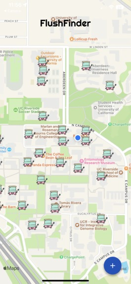
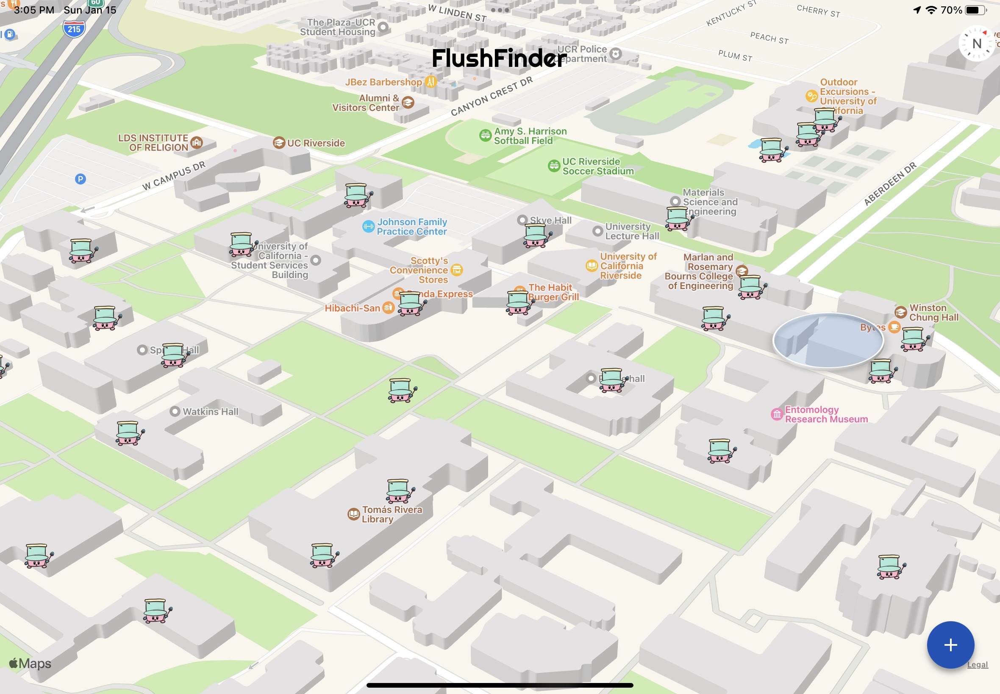

# FlushFinder
> Submission for Rose Hack 2023 @ University of California, Riverside, **Won Best UI/UX Track**

An app to find the nearest bathroom to you. Create, like, comment, and customize bathrooms.

Created by **Team Rocket**: Coco Chen, Justin Figueroa, Steven Hoang, and Linda Ly. 

## Tech
### Frontend
Frontend was written with React Native. We used the Google Maps Platform API to show a map in the app interface. Deploy the app locally using Expo Go.

### Backend
Backend was written using Node.js and Express.js for HTTP endpoints. Database uses Google Cloud Firestore and authenticated on the backend server.

### Additional Links
[DevPost](https://devpost.com/software/flushfinder)